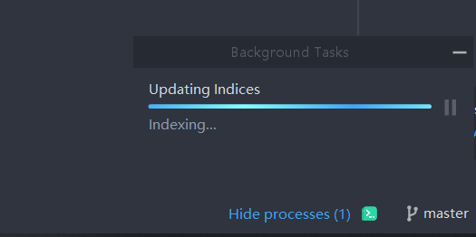

# 说明

## 项目说明

springboot商城

## 软件说明

idea2020.2.2、MySQL8、redis

# 步骤

# 出错

## IDEA 出现 updating indices 卡进度条问题

> 转自：
>
> [一起游](https://www.17you.com/)：https://www.17you.com/aid/36570.html
>
> [姚琨的博客](https://me.csdn.net/weixin_42478413)：https://blog.csdn.net/weixin_42478413/article/details/81631300
>
> [李布斯·大魔王](https://me.csdn.net/libusi001)：https://blog.csdn.net/libusi001/article/details/102800605

参考转自，解决后，初次启动时间较长，完成后关闭再次打开就解决了。

## java.net.ConnectException: Connection refused: no further information

可能为redis没有启动导致

## 卸载掉冲突的mybatis插件

