# 建立springboot项目

## 1、选择springboot

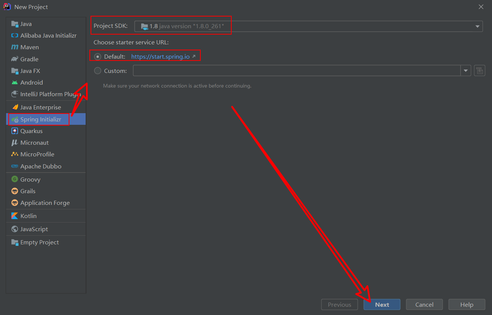

## 2、选择版本

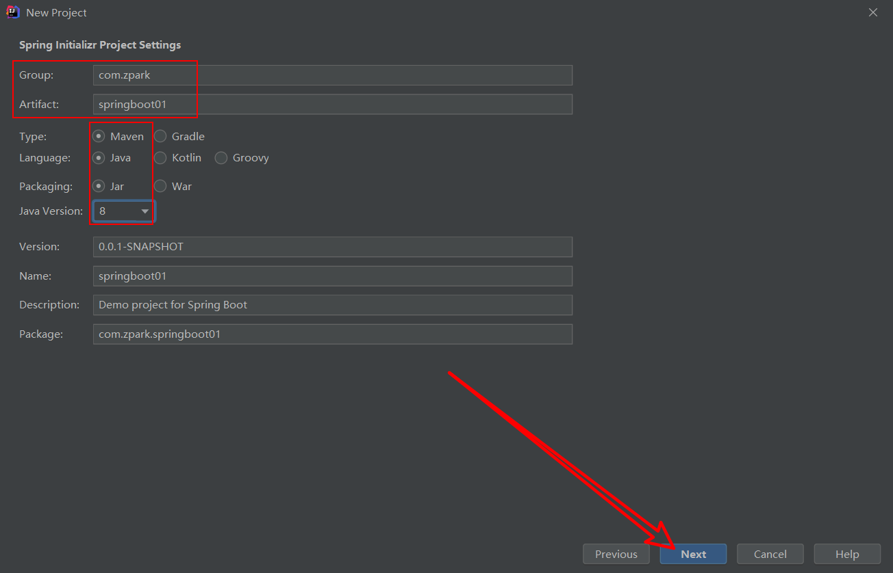

## 3、选择Lombok、SpringWeb依赖

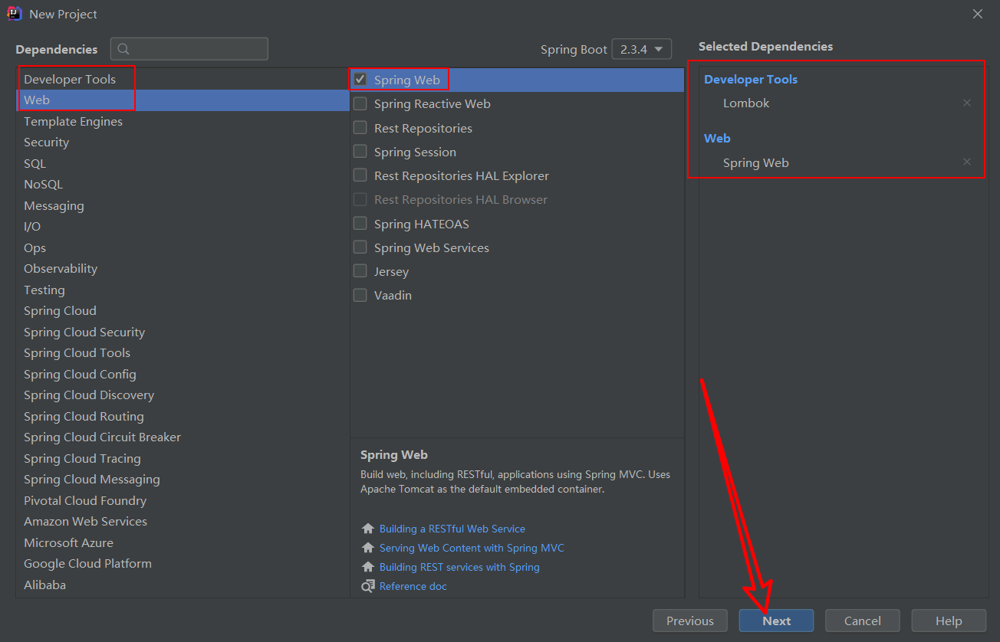

## 4、选择代码位置


## 5、完成后的界面

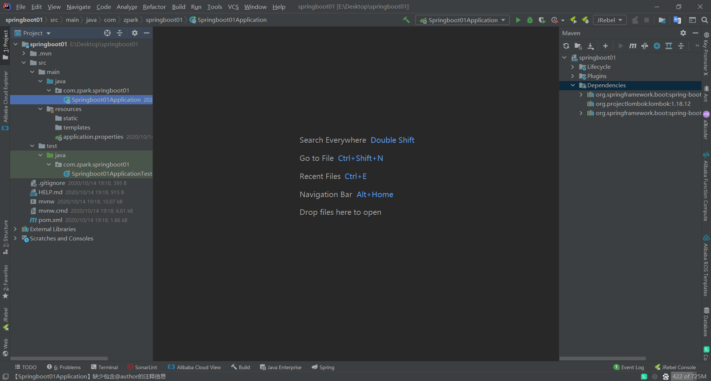

## 6、启动

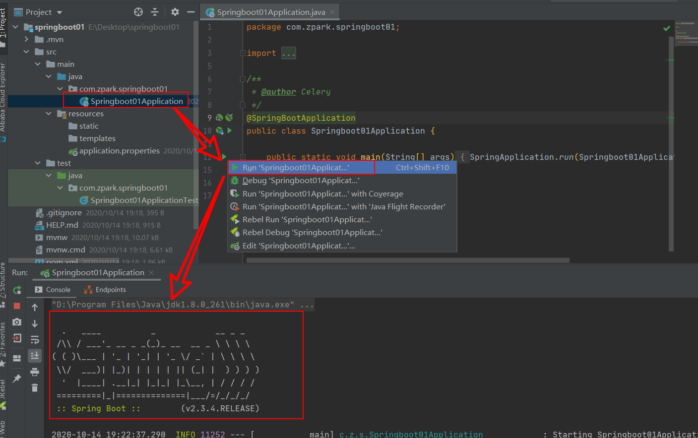

**附加如何更改启动时显示的字符拼成的字母，SpringBoot呢？也就是 banner 图案**

> 转自 [狂神说](javascript:void(0);)：https://dwz.cn/P1N121RT

只需一步：到项目下的 resources 目录下新建一个banner.txt 即可。图案可以到：https://www.bootschool.net/ascii 这个网站生成，然后拷贝到文件中即可！

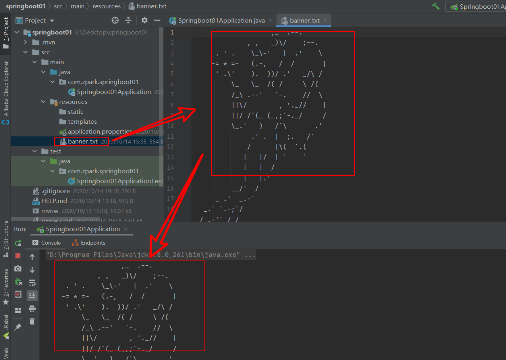

## 7、修改文件为yml，写入配置

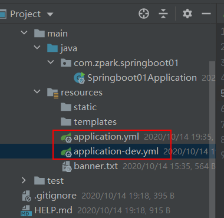

application.yml

```yml
# yet another markup language   yml -> yaml   更像json文件

spring:
  application:
    # 当前应用的名称
    name: springboot01
  profiles:
    # 设置当前环境为dev(开发环境)
    active: dev
```

application-dev.yml

```yml
# 开发环境的配置文件

# 配置服务的端口号
server:
  # 默认8080
  port: 8081

spring:
  profiles: dev
```

**注意：yml的层级(以空格为准)**

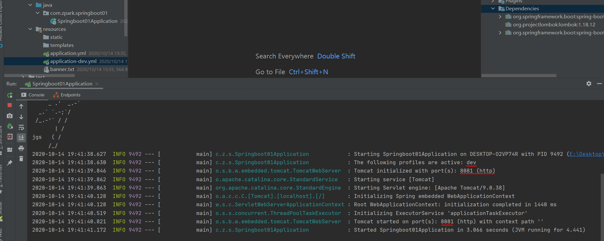

**附加**

## 8、简单运行

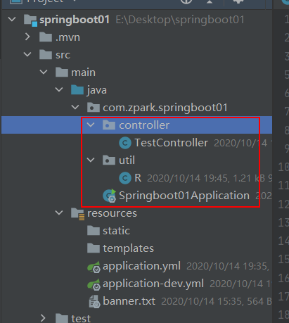

Springboot01Application.java

```java
package com.zpark.springboot01;

import org.springframework.boot.SpringApplication;
import org.springframework.boot.autoconfigure.SpringBootApplication;

/**
 * @author Celery
 * 这个类是当前项目的启动类
 * 1、将tomcat集成在springboot中，可以将项目打成.jar包，只要有Java环境就可以运行；
 * 2、约定大于配置；
 * 3、启动器：如果需要使用spring boot去整合其他框架或工具，只需要在依赖中增加对应的启动器即可；
 * 4、自动装配；
 */
@SpringBootApplication
public class Springboot01Application {

    public static void main(String[] args) {
        SpringApplication.run(Springboot01Application.class, args);
    }

}
```

R.java

```java
package com.zpark.springboot01.util;

import lombok.Data;

import java.util.HashMap;
import java.util.Map;

/**
 * @author Celery
 */
@Data
public class R {

    /**
     * 状态码
     */
    private Integer code;
    /**
     * 封装的信息
     */
    private String message;
    /**
     * 封装的数据
     */
    private Map<String, Object> data = new HashMap<>();

    /**
     * 操作成功的状态
     *
     * @param message 信息
     * @return R对象
     */
    public static R ok(String message) {
        R r = new R();
        r.setCode(1);
        r.setMessage(message);
        return r;
    }

    /**
     * 操作失败的状态
     *
     * @param message 信息
     * @return R对象
     */
    public static R error(String message) {
        R r = new R();
        r.setCode(0);
        r.setMessage(message);
        return r;
    }

    /**
     * 链式增加data数据的方法
     *
     * @param key   数据的键
     * @param value 数据的值
     * @return R对象
     */
    public R addData(String key, Object value) {
        this.data.put(key, value);
        return this;
    }

}
```

TestController.java

```java
package com.zpark.springboot01.controller;

import com.zpark.springboot01.util.R;
import org.springframework.web.bind.annotation.GetMapping;
import org.springframework.web.bind.annotation.RequestMapping;
import org.springframework.web.bind.annotation.RestController;

/**
 * @author Celery
 */
@RestController
@RequestMapping("/test")
public class TestController {

    @GetMapping("/test1")
    public Object test1() {
        return R.ok("请求成功!");
    }

}
```

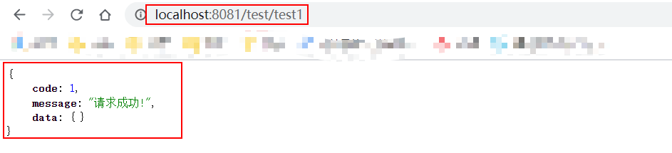

### 使用post方法提交数据

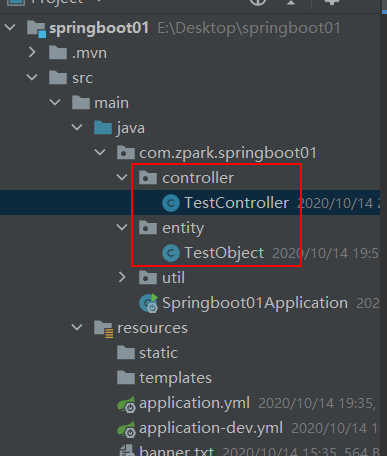

TestObject.java

```java
package com.zpark.springboot01.entity;

import lombok.Data;

import java.io.Serializable;

/**
 * @author Celery
 */
@Data
public class TestObject implements Serializable {
    private Integer a;
    private String b;
}
```

**当请求体的类型为application/x-www-form-urlencoded,封装的对象不需要任何注解**

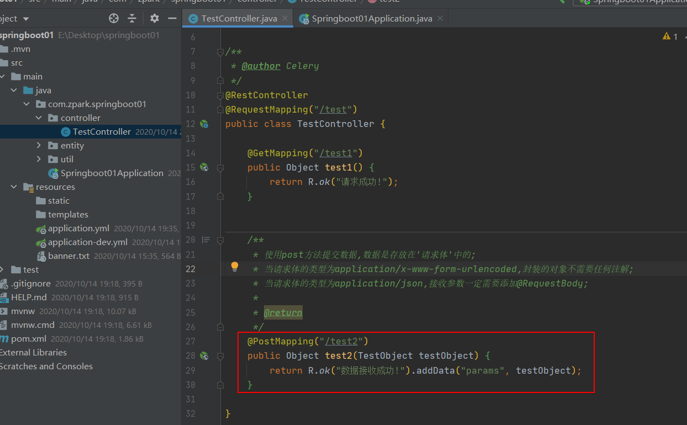

```java
/**
 * 使用post方法提交数据,数据是存放在'请求体'中的;
 * 当请求体的类型为application/x-www-form-urlencoded,封装的对象不需要任何注解;
 * 当请求体的类型为application/json,接收参数一定需要添加@RequestBody;
 *
 * @return
 */
@PostMapping("/test2")
public Object test2(TestObject testObject) {
    return R.ok("数据接收成功!").addData("params", testObject);
}
```

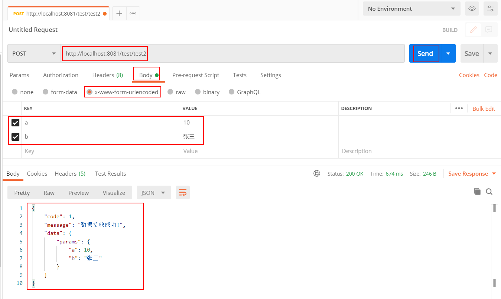

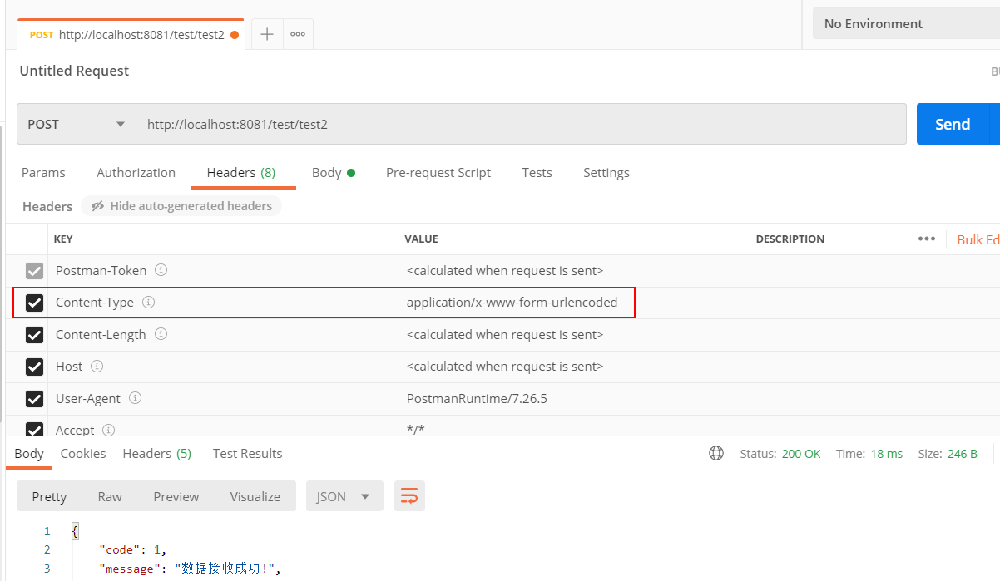

**当请求体的类型为application/json,接收参数一定需要添加@RequestBody**

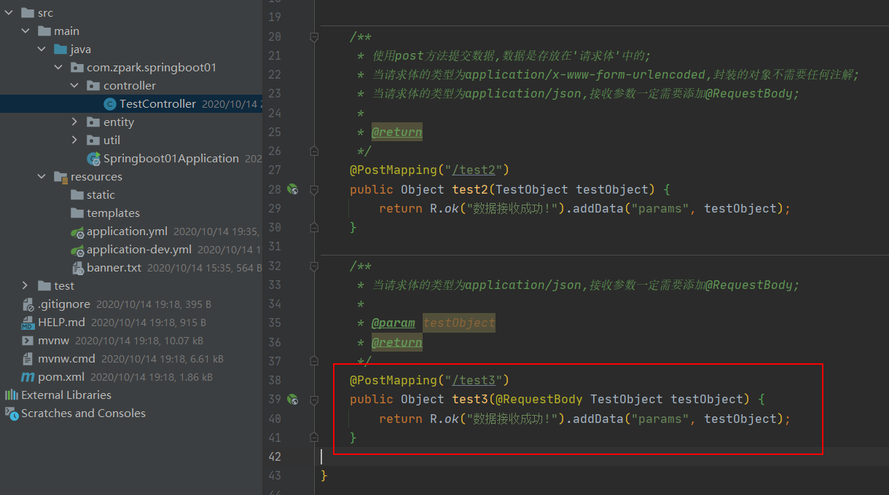

```java
/**
 * 当请求体的类型为application/json,接收参数一定需要添加@RequestBody;
 *
 * @param testObject
 * @return
 */
@PostMapping("/test3")
public Object test3(@RequestBody TestObject testObject) {
return R.ok("数据接收成功!").addData("params", testObject);
}
```

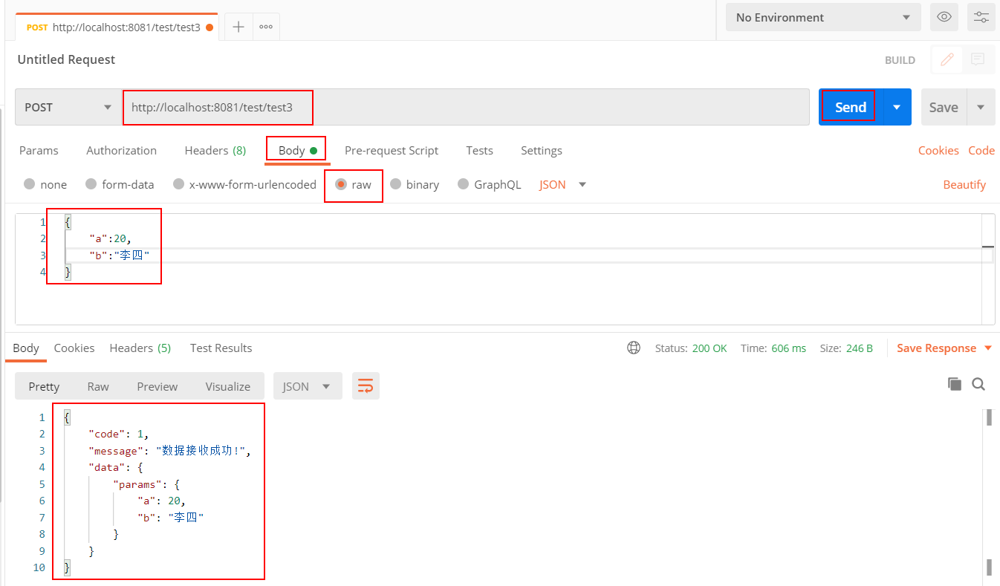

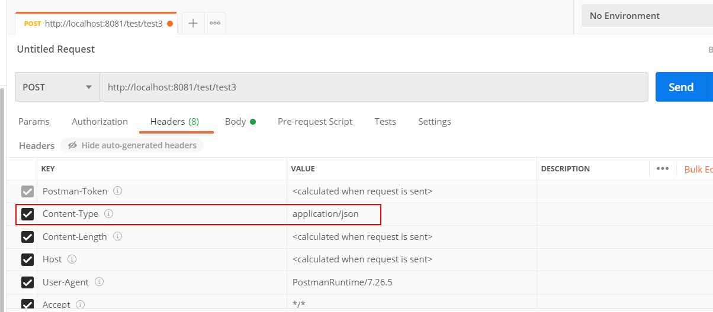


## 9、


# 建立vue-cli项目

## 1、建立vue-cli初始模板

```
创建vue-cli文件夹：vue create vue_cli03
```

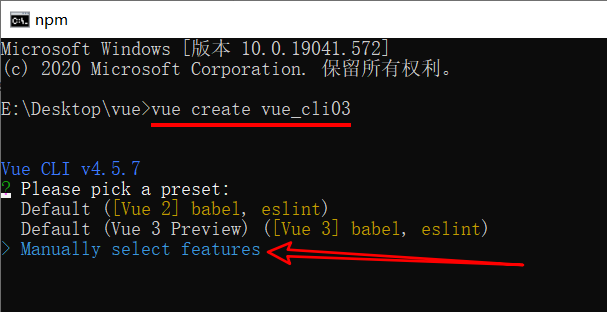

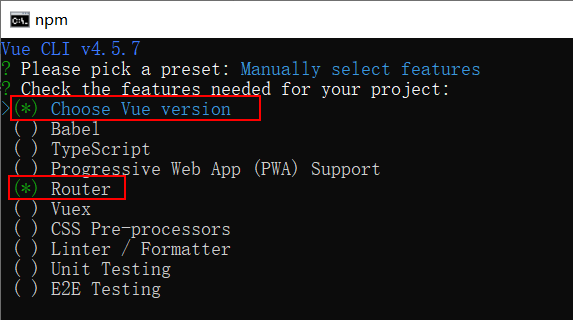

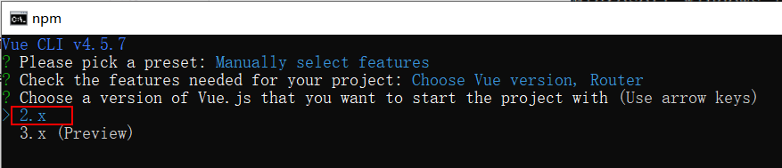

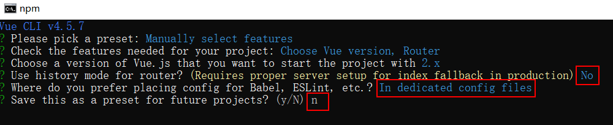

创建完成

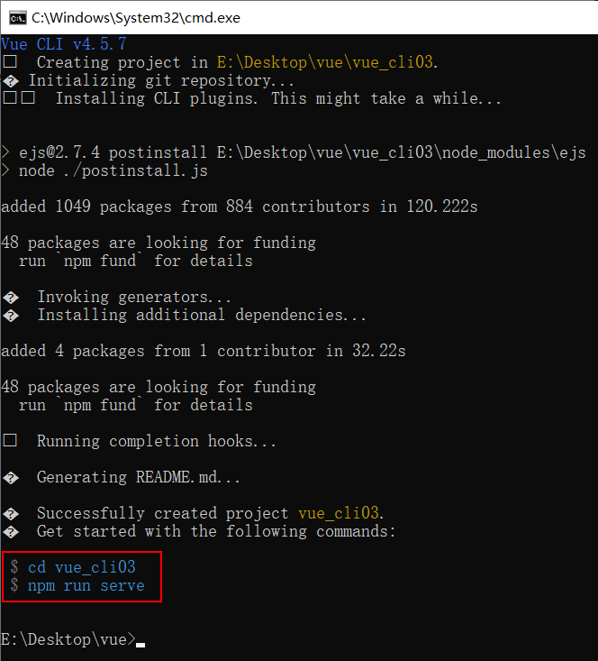

## 2、使用vscode打开此文件夹

### 打开终端

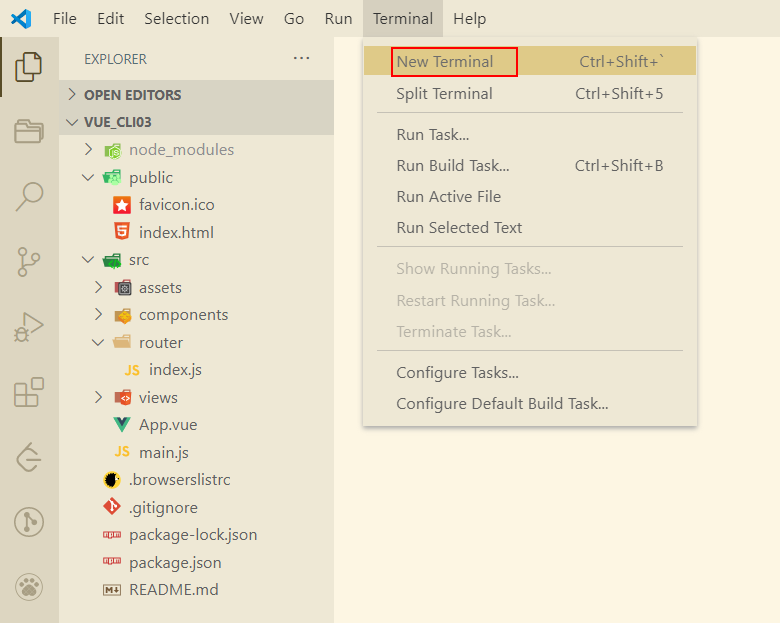

### axios

```http
axios中文网：http://axios-js.com/
axios之Github：https://github.com/axios/axios
jsonplaceholder：http://jsonplaceholder.typicode.com/
```

```
安装命令：vue add axios
```

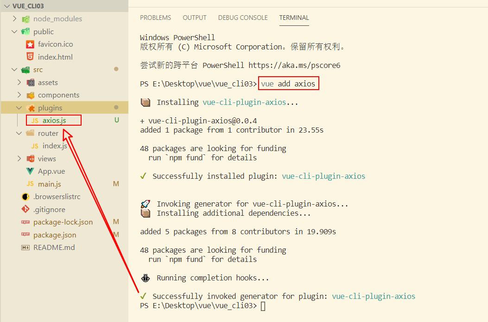

对axios.js进行设置

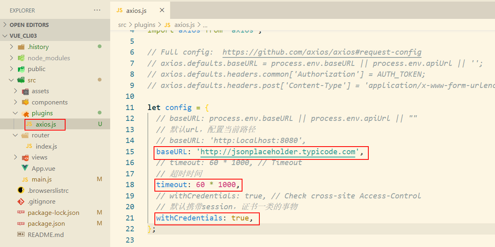

```js
let config = {
  // baseURL: process.env.baseURL || process.env.apiUrl || ""
  // 默认url，配置当前路径
  // baseURL: 'http:localhost:8080',
  baseURL: 'http://jsonplaceholder.typicode.com',
  // timeout: 60 * 1000, // Timeout
  // 超时时间
  timeout: 60 * 1000,
  // withCredentials: true, // Check cross-site Access-Control
  // 默认携带session，证书一类的事物
  withCredentials: true,
};
```

编写App.vue

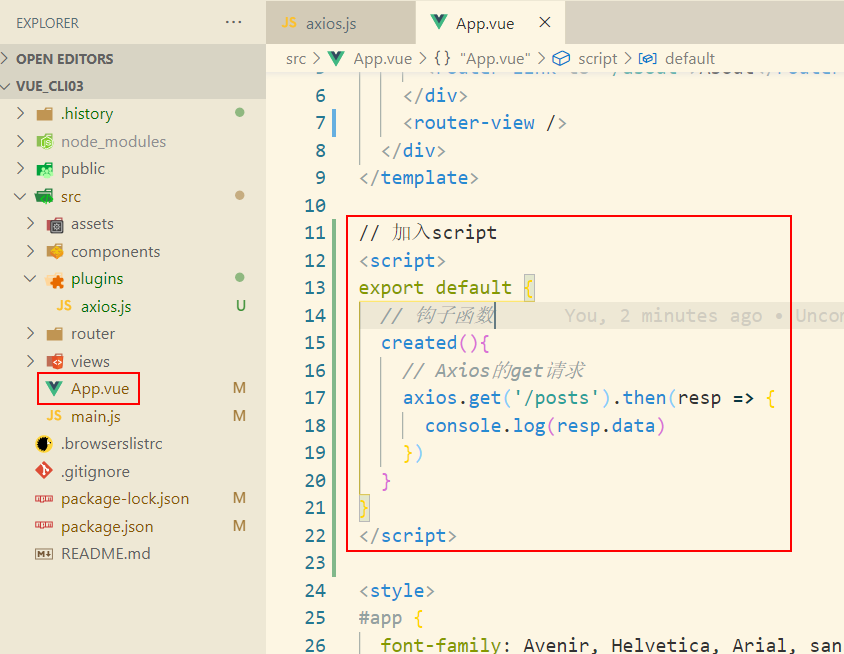

```vue
// 加入script
<script>
export default {
  // 钩子函数
  created(){
    // Axios的get请求
    axios.get('/posts').then(resp => {
      console.log(resp.data)
    })
  }
}
</script>
```

运行，点击网址，在浏览器中打开是否有值

```
npm run serve
```

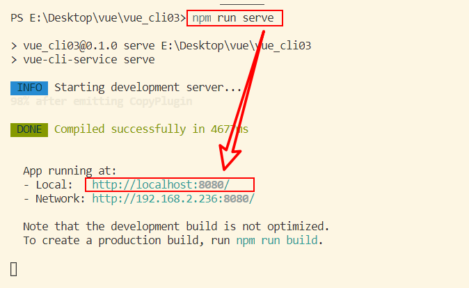

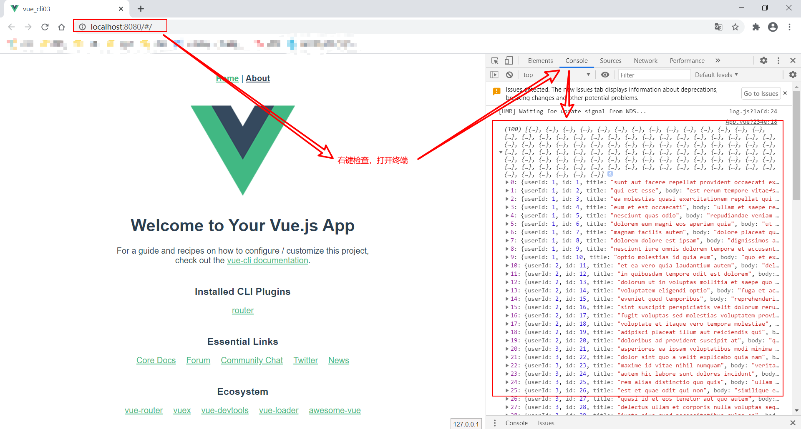

**注：**两次Ctrl+C可中断服务运行。

之后的类似

```vue
// 加入script
<script>
export default {
  // 钩子函数
  created(){
    // // Axios的get请求
    // axios.get('/posts').then(resp => {
    //   console.log(resp.data)
    // })

    // // Axios的post请求
    // axios.post("/posts").then(resp => {
    //   // 在axios中的then的异步操作传入的箭头函数能不能使用this指代vue的实例呢？可以的
    //   console.log(resp.data)
    // })

    // // 带参数的提交Get
    // axios.get('/comments',{params:{postId:1}}).then(resp => {
    //   console.log(resp.data)
    // })

    // // 带参数的提交Post
    // axios.post('/posts',{title:'foo',body:'bar',userId:1}).then(resp => {
    //   console.log(resp.data)
    // })

    // axios.get('/comments',{params:{postId:1}}).then(resp => {
    //   console.log(resp.data)
    // })

    // axios.post('/posts',{title:'foo',body:'bar',userId:1},{headers:{'Content-Type':'application/x-www-urlencoded'}}).then(resp =>{
    //   console.log(resp.data)
    // })
    
  }
}
</script>
```

### bootstrap和jQuery

```
bootstrap中文网：https://www.bootcss.com/
bootstrap：https://v3.bootcss.com/
bootstrap：https://getbootstrap.com/
Bootstrap可视化布局系统：https://www.bootcss.com/p/layoutit/
菜鸟Bootstrap可视化布局系统：https://www.runoob.com/try/bootstrap/
```

```
<-- 安装bootstrap -->
vue add bootstrap
```

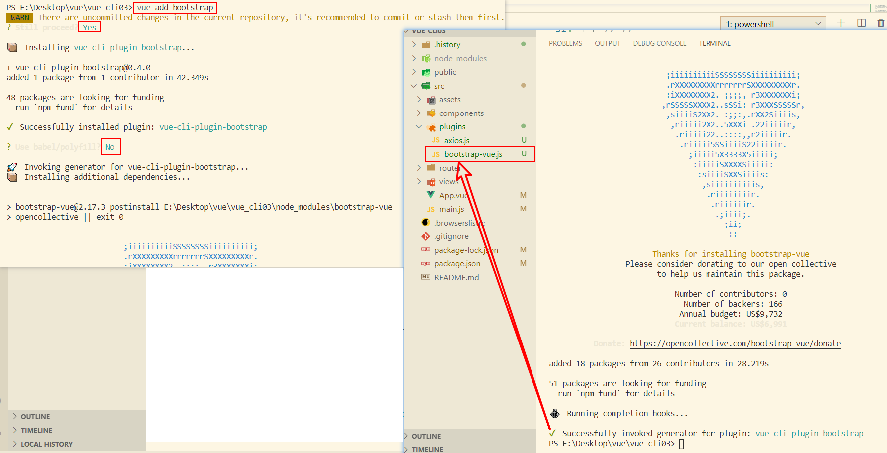

去bootstrap网找样式放到App.vue中，运行看效果(可同时查看钩子函数中传参的情况)

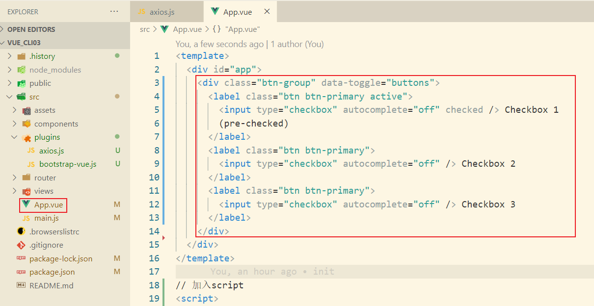

```vue
<template>
  <div id="app">
    <div class="btn-group" data-toggle="buttons">
      <label class="btn btn-primary active">
        <input type="checkbox" autocomplete="off" checked /> Checkbox 1
        (pre-checked)
      </label>
      <label class="btn btn-primary">
        <input type="checkbox" autocomplete="off" /> Checkbox 2
      </label>
      <label class="btn btn-primary">
        <input type="checkbox" autocomplete="off" /> Checkbox 3
      </label>
    </div>
  </div>
</template>
```

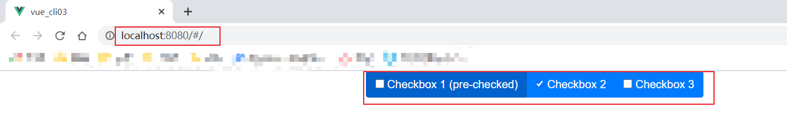

```
<!-- 安装jQuery -->
cnpm install --save jQuery
npm install --save jsdom location navigator xmlhttprequest
npm install --save bootstrap-vue bootstrap-vue
```

```vue
// 加入script
<script>
// 导入jQuery
import $ from 'jQuery'
export default {
  // 钩子函数
  created(){
    // // Axios的get请求
    // axios.get('/posts').then(resp => {
    //   console.log(resp.data)
    // })

    // // Axios的post请求
    // axios.post("/posts").then(resp => {
    //   // 在axios中的then的异步操作传入的箭头函数能不能使用this指代vue的实例呢？可以的
    //   console.log(resp.data)
    // })

    // // 带参数的提交Get
    // axios.get('/comments',{params:{postId:1}}).then(resp => {
    //   console.log(resp.data)
    // })

    // // 带参数的提交Post
    // axios.post('/posts',{title:'foo',body:'bar',userId:1}).then(resp => {
    //   console.log(resp.data)
    // })

    // axios.get('/comments',{params:{postId:1}}).then(resp => {
    //   console.log(resp.data)
    // })

    // axios.post('/posts',{title:'foo',body:'bar',userId:1},{headers:{'Content-Type':'application/x-www-urlencoded'}}).then(resp =>{
    //   console.log(resp.data)
    // })

    // 导入jQuery后，使用传统方式使用
    $.get('http://jsonplaceholder.typicode.com/posts',function (result) {
      console.log(result)
    })

  }
}
</script>
```

最终效果：

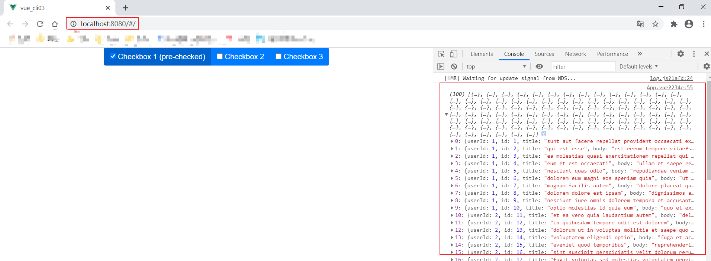

**注**：cnpm安装失败时，可换npm，两个可互换使用，最终效果一致

> 转自[HT_Jonson](https://www.jianshu.com/u/9c16e24cb801)：https://www.jianshu.com/p/261eea9b3f4d

**Unexpected end of JSON input while parsing near错误解决办法，安装命令：npm cache clean --force**


判断是否形成跨域，要看当前的网页的URL与请求数据的URL的**协议、域名、端口号**是否一致，三者有一个不一样都会形成跨域

```
http://localhost:8080
http://localhost:8081
```

方法一：springboot解决跨域问题

方法二：前台解决前台代理服务器，然后用服务器进行