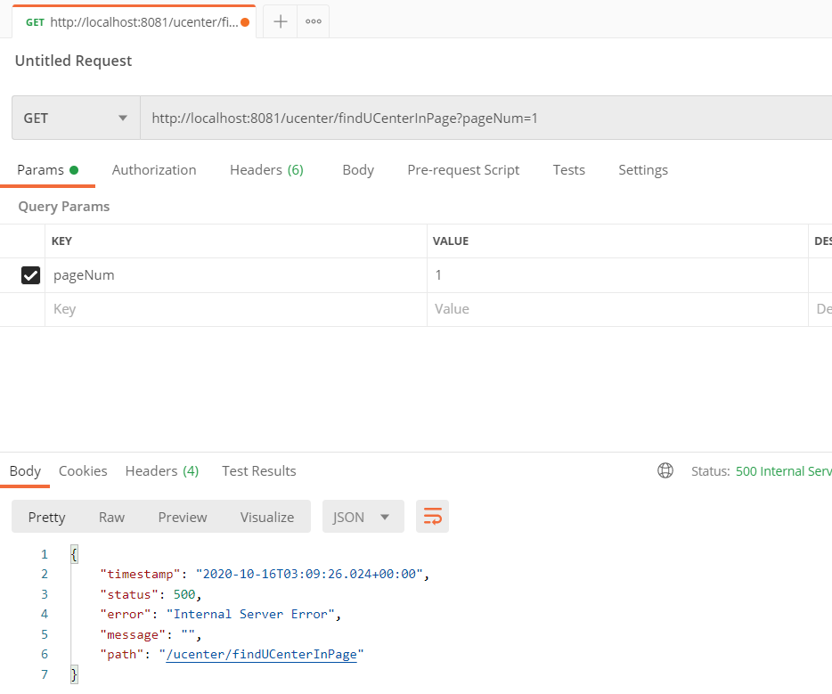
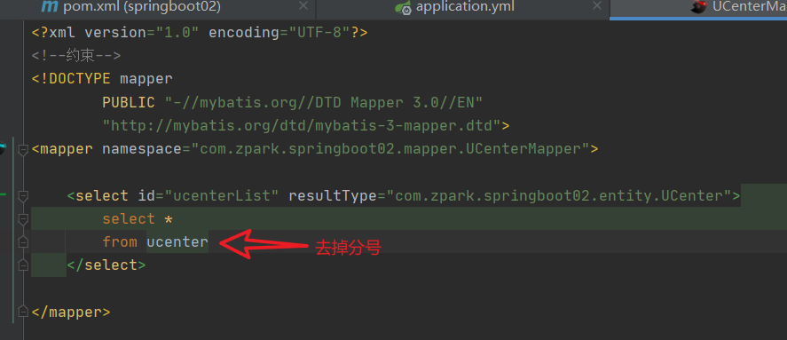
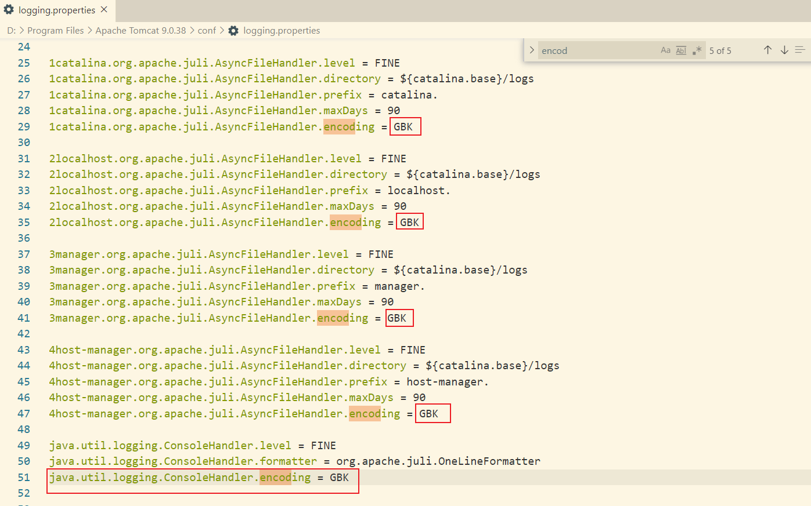
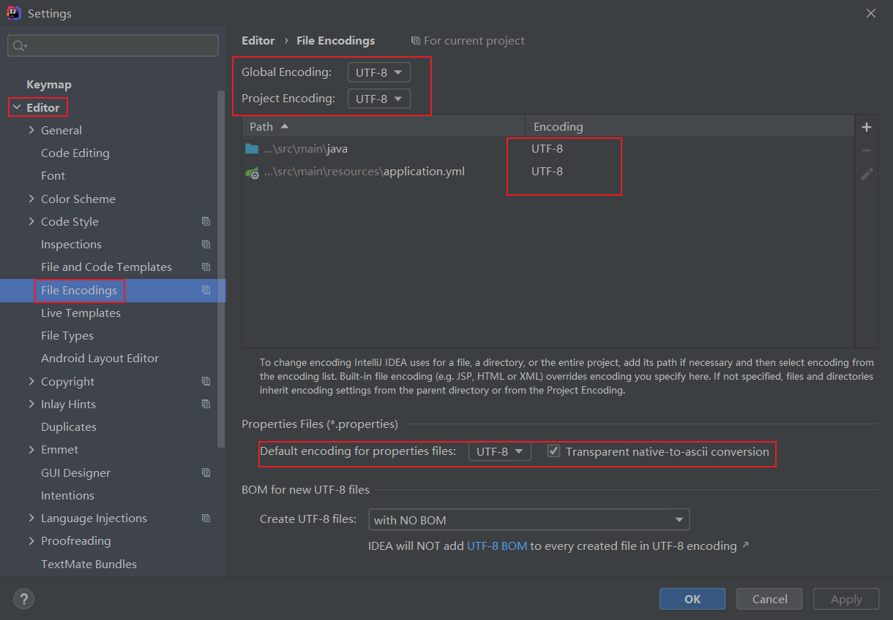
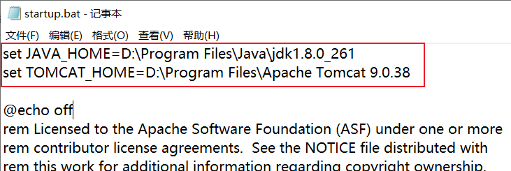

# 说明
此项目有邮件发送、支付功能，没有关联

# 软件
```
Idea2020.2.2
数据库MySql8.0
Navicat可视化工具
PostMan
```

# 步骤

运行成功后，打开PostMan测试发送是否成功；打开浏览器测试是否可以支付。


# 支付宝沙箱

> 转自[别动我的猫](https://home.cnblogs.com/u/zeussbook/)：https://www.cnblogs.com/zeussbook/p/10238007.html
>
> 支付宝开发平台：https://open.alipay.com或https://open.alipay.com/platform/home.htm
>
> 支付宝官方开发文档：https://opendocs.alipay.com/open/00hqwq

1、支付宝登录开发平台


2、选择


# 出错

可能为spring boot分页插件导致，把sql语句后分号去掉





# 附加
## 乱码

>转自[Alan_beijing](https://me.csdn.net/u010228798)：https://blog.csdn.net/u010228798/article/details/93355667

### Tomcat乱码

将UTF-8的编码改为GBK



### Idea乱码

设置Inllij idea文件编码格式，设置为UTF-8。File=>Settings=>Editor=>File Encodings



配置Tomcat VM options值、Intellij idea安装目录的bin目录下的idea.exe.vmoptions和idea64.exe.vmoptions两个文件结尾都配置为：-Dfile.encoding=UTF-8


**ps：出现乱码可以使用在线工具转换为中文**

```
在线转换：
http://www.jsons.cn/unicode/
https://tool.oschina.net/encode
http://tool.chinaz.com/Tools/unicode.aspx
https://c.runoob.com/front-end/3602
https://www.toolbaba.cn/d/dev_str_encode
```

## Tomcat无法成功启动——双击startup.bat闪退

>转自[SCAU林庭辉](https://me.csdn.net/scau_lth)：https://blog.csdn.net/scau_lth/article/details/83218335

**在已解压的tomcat的bin文件夹下找到shutdown.bat，右击->编辑。在文件头加入下面两行：**

```
SET JAVA_HOME=D:\Java\jdk1.7 （java jdk目录）
SET TOMCAT_HOME=E:\tomcat-7.0 （解压后的tomcat文件目录）
```



