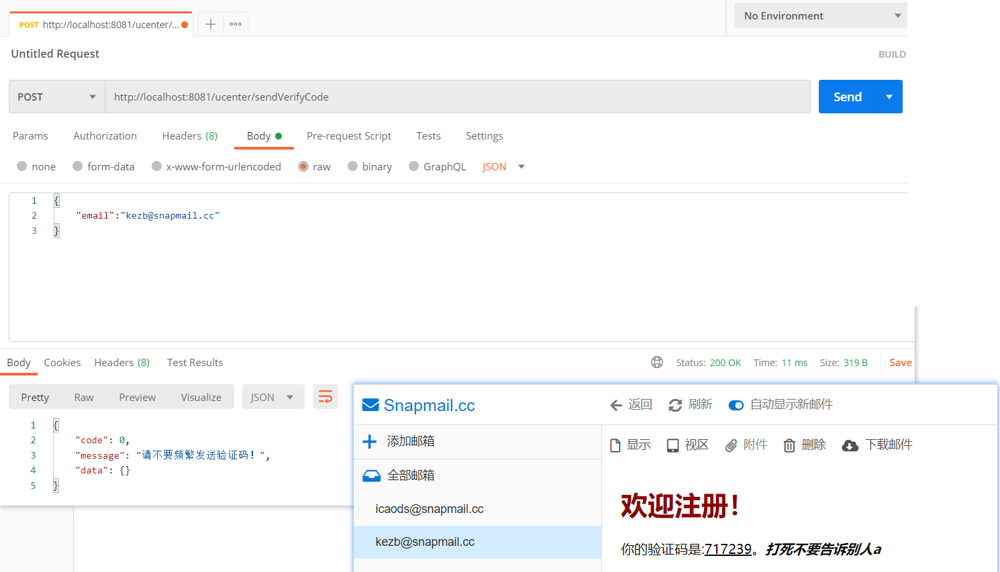
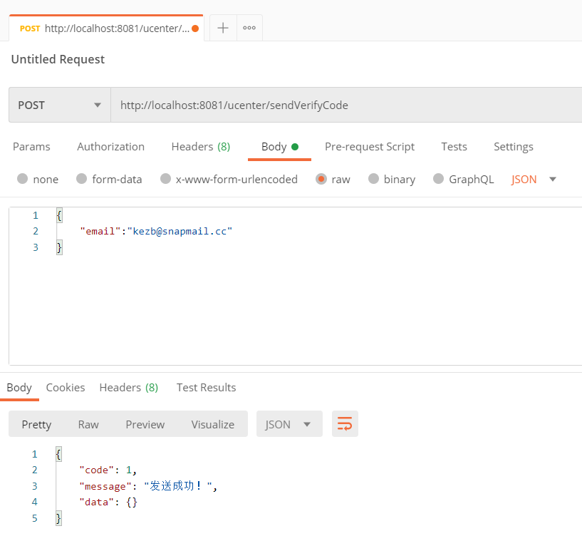
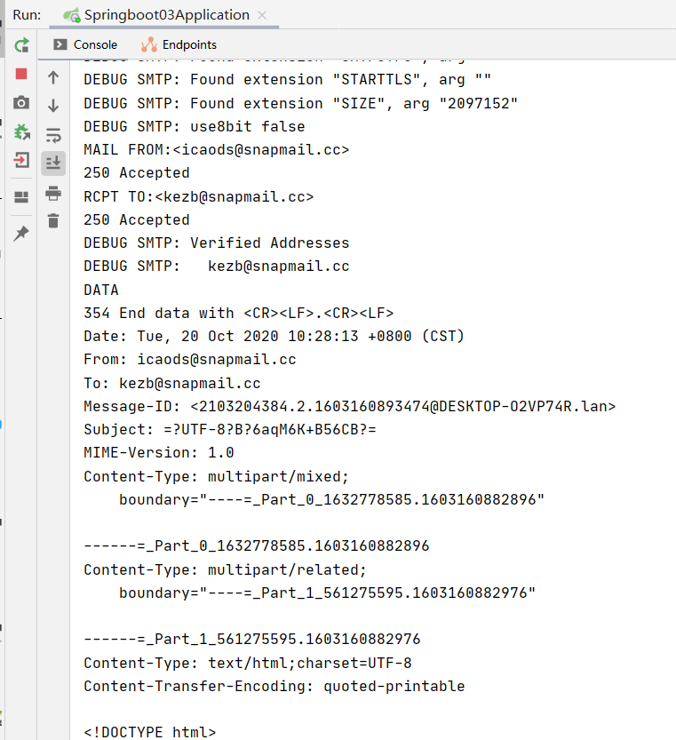
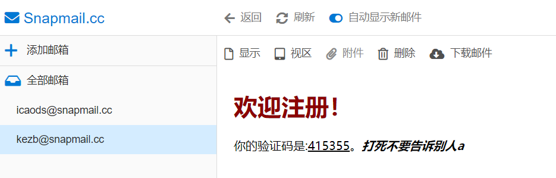
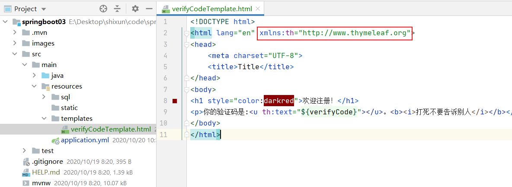
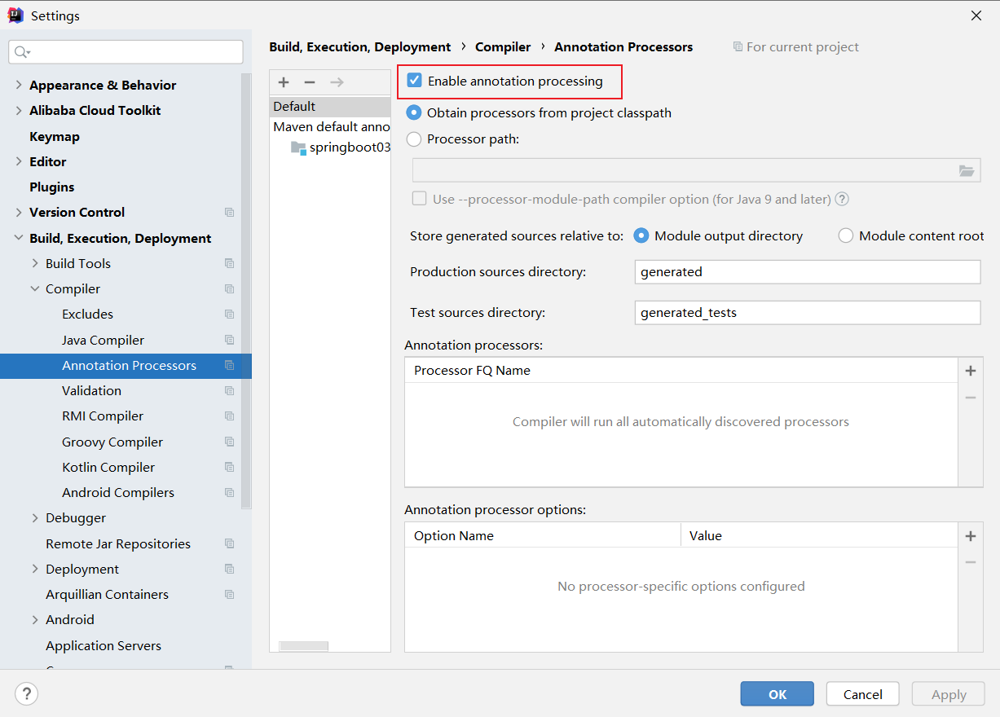
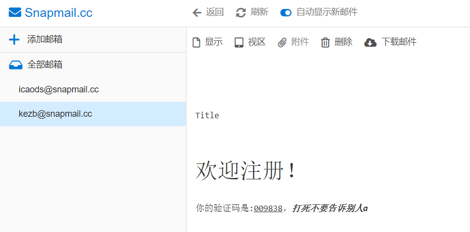
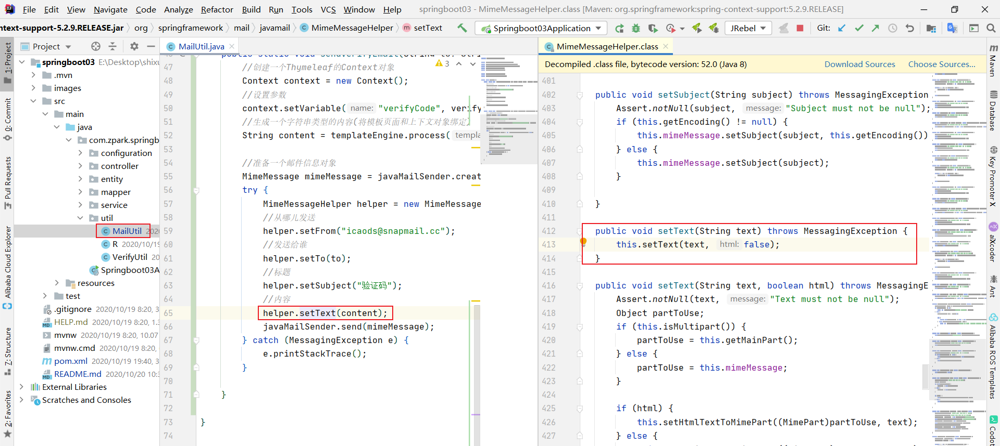
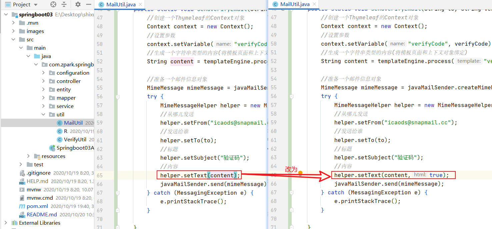
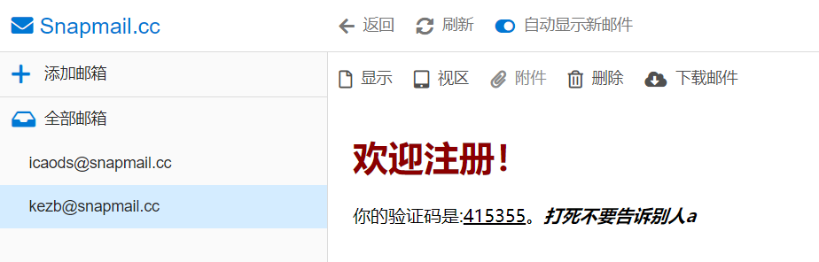

# 使用临时邮箱发送临时邮件

>转自[Jayden](https://www.zhihu.com/people/jayden-58-50)：https://www.zhihu.com/question/22573855/answer/1331434944
>
>snapmail：https://www.snapmail.cc

你在什么情况需要使用Snapmail SMTP？

- 你正在开发或者测试邮箱注册或者重置密码等功能，但是你没有SMTP服务器来发邮件。

SMTP Server

- **Host**: mail.snapmail.cc
- **端口**: 25
- 他是匿名的，不需要用户名和密码。
- 你只能发邮件到@snapmail.cc
- 请检查你的网络环境是否屏蔽了25端口。




优势：不泄露隐私。

不好之处：只能发邮件到@snapmail.cc；邮箱临时。

# 发送邮件步骤

启动idea，运行springboot03项目；启动redis；打开postman，出现的效果如下：







# 模板引擎

旧：jsp

新：Freemarker、Thymeleaf

```http
Thymeleaf官网：https://www.thymeleaf.org/
Freemarker官网：https://freemarker.apache.org/
Freemarker中文官网：http://www.freemarker.cn/
```

注意：这儿要使用Thymeleaf官网的网址



```html
<html lang="en" xmlns:th="http://www.thymeleaf.org">
```


# 出错

## Lombok Requires Annotation Processing: Do you want to enable annotation processors?Enable

> 转自[田潇文](https://me.csdn.net/weixin_44259720)：https://blog.csdn.net/weixin_44259720/article/details/105934467

更新插件或指明不处理。



## 出现Could not autowire. No beans of 'xxx' type found

网络不稳定导致依赖下载不全。

例如：springboot使用redis启动器时，maven一直出错，可以试试用redis的依赖(二者只能使用其一)，网络佳时在使用redis启动器。

```xml
<!--springboot之redis启动器依赖-->
<dependency>
    <groupId>org.springframework.boot</groupId>
    <artifactId>spring-boot-starter-data-redis</artifactId>
</dependency>
```

```xml
<!--redis依赖-->
<dependency>
    <groupId>redis.clients</groupId>
    <artifactId>jedis</artifactId>
</dependency>
<dependency>
    <groupId>org.springframework.data</groupId>
    <artifactId>spring-data-redis</artifactId>
</dependency>
```

## 在系统中发现多个分页插件，请检查系统配置


解决办法：检查导入的分页包是否正确或重新启动服务。

## 序列化导致多次请求出现异常


解决办法：接口改为Object对象


## 解决发送HTML模板邮件显示源码、样式不全的问题



解决方式：看源码得知，不传第二个参数的方法，html格式默认值为false，需要手动调整为true，则按照html格式显示。





解决完成：



