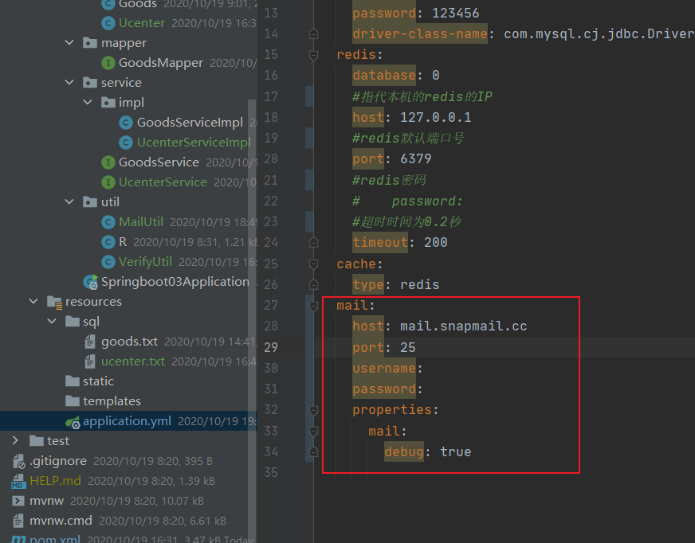
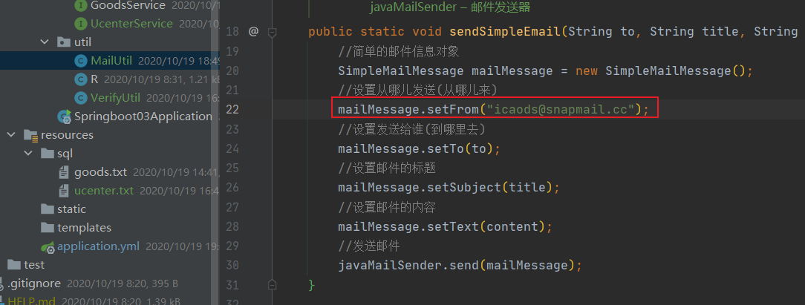
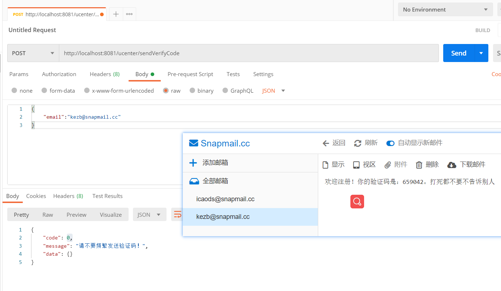

# 使用临时邮箱发送临时邮件

>转自[Jayden](https://www.zhihu.com/people/jayden-58-50)：https://www.zhihu.com/question/22573855/answer/1331434944
>
>snapmail：https://www.snapmail.cc

你在什么情况需要使用Snapmail SMTP？

- 你正在开发或者测试邮箱注册或者重置密码等功能，但是你没有SMTP服务器来发邮件。

SMTP Server

- **Host**: mail.snapmail.cc
- **端口**: 25
- 他是匿名的，不需要用户名和密码。
- 你只能发邮件到@snapmail.cc
- 请检查你的网络环境是否屏蔽了25端口。

优势：不泄露隐私。

不好之处：只能发邮件到@snapmail.cc；邮箱临时。

# 出错

## Lombok Requires Annotation Processing: Do you want to enable annotation processors?Enable

> 转自[田潇文](https://me.csdn.net/weixin_44259720)：https://blog.csdn.net/weixin_44259720/article/details/105934467

## 在系统中发现多个分页插件，请检查系统配置

解决办法：检查导入的分页包是否正确或重新启动服务。

## 序列化导致多次请求出现异常

解决办法：接口改为Object对象

