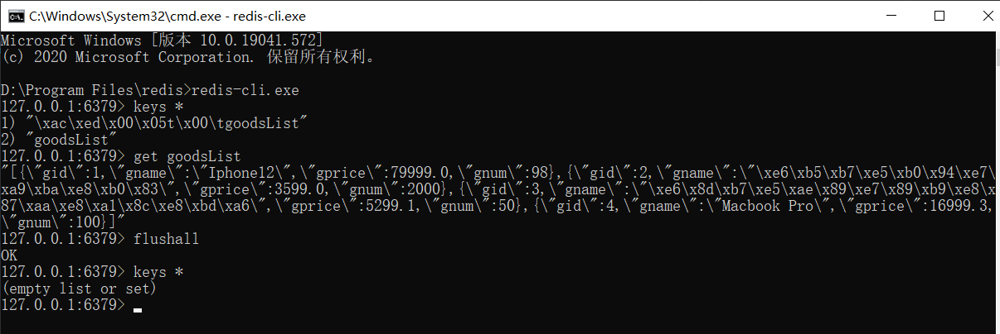

# 出错

## Lombok Requires Annotation Processing: Do you want to enable annotation processors?Enable

> 转自[田潇文](https://me.csdn.net/weixin_44259720)：https://blog.csdn.net/weixin_44259720/article/details/105934467

## 在系统中发现多个分页插件，请检查系统配置

解决办法：检查导入的分页包是否正确或重新启动服务。

## 序列化导致多次请求出现异常

解决办法：接口改为Object对象

