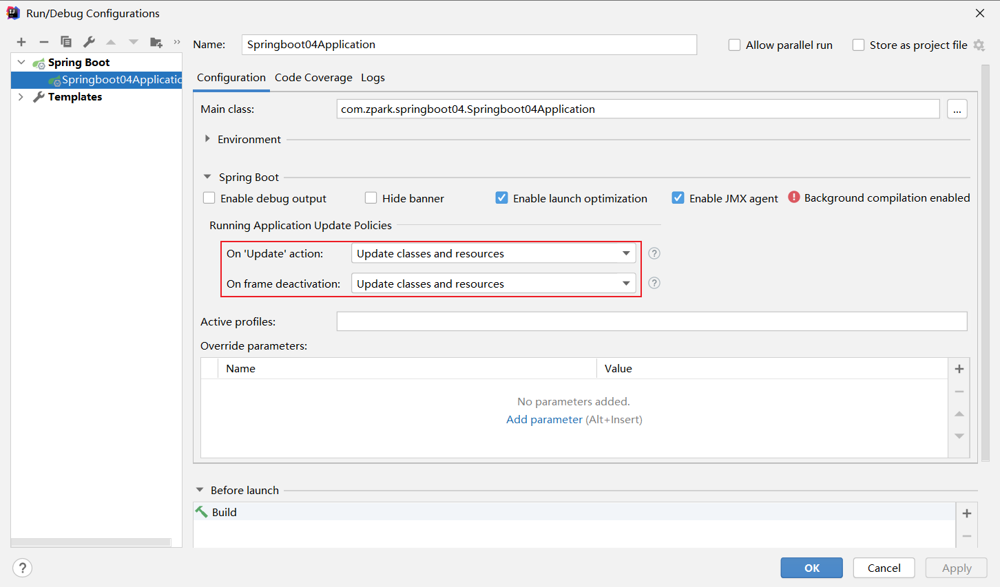
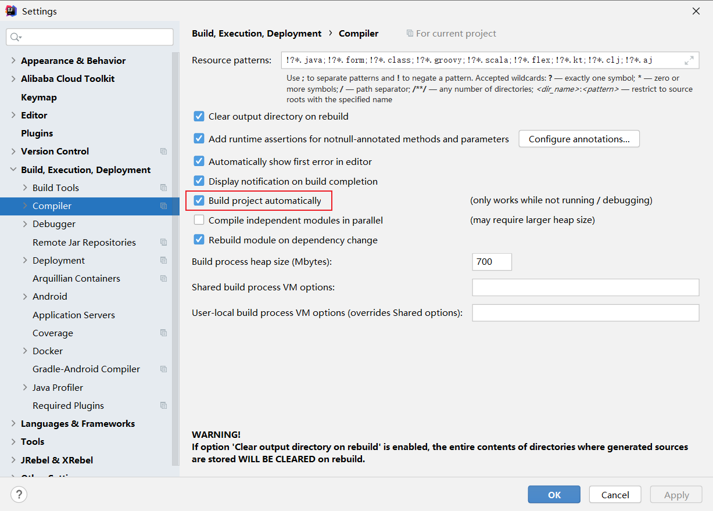
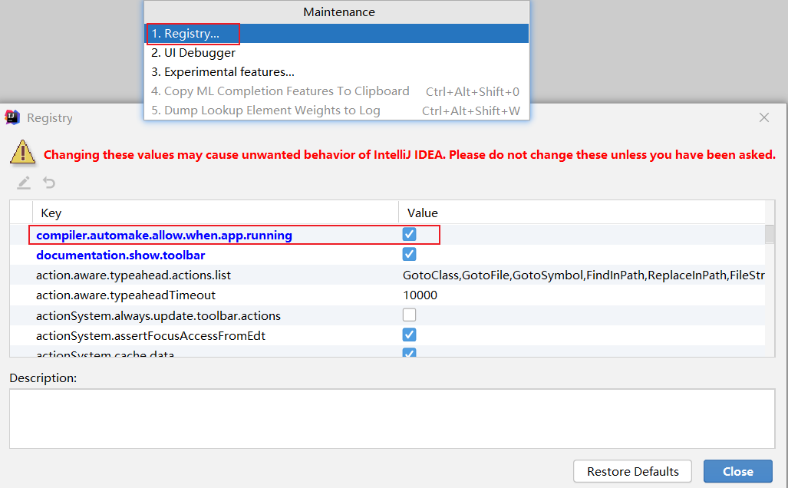

# 说明


# springboot热部署

> 转自：
>
> [Java编程精选](javascript:void(0);)：
>
> [yizhiwazi](https://www.jianshu.com/u/590460954c1d)：https://www.jianshu.com/p/f658fed35786
>
> [yizhiwazi](https://www.jianshu.com/u/590460954c1d)：https://www.jianshu.com/p/9c65b7613c30

## spring-boot-devtools

1、加入依赖

```xml
<dependency>
    <groupId>org.springframework.boot</groupId>
    <artifactId>spring-boot-devtools</artifactId>
    <scope>runtime</scope>
    <optional>true</optional>
</dependency>
```

2、



3、



4、使用快捷键Ctrl+Shift+Alt+？



